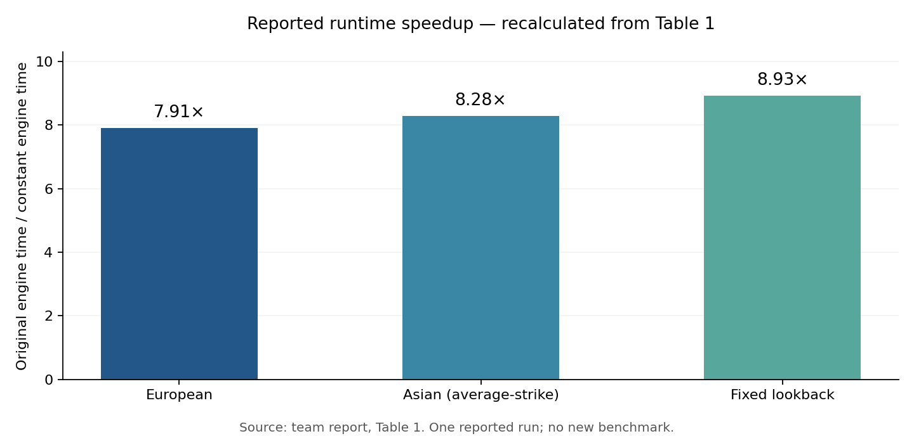
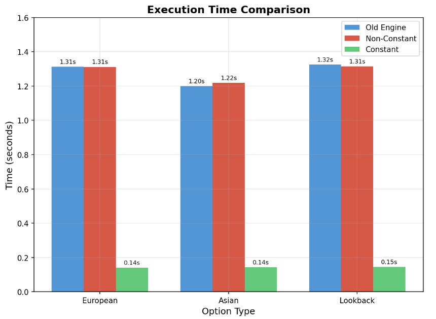
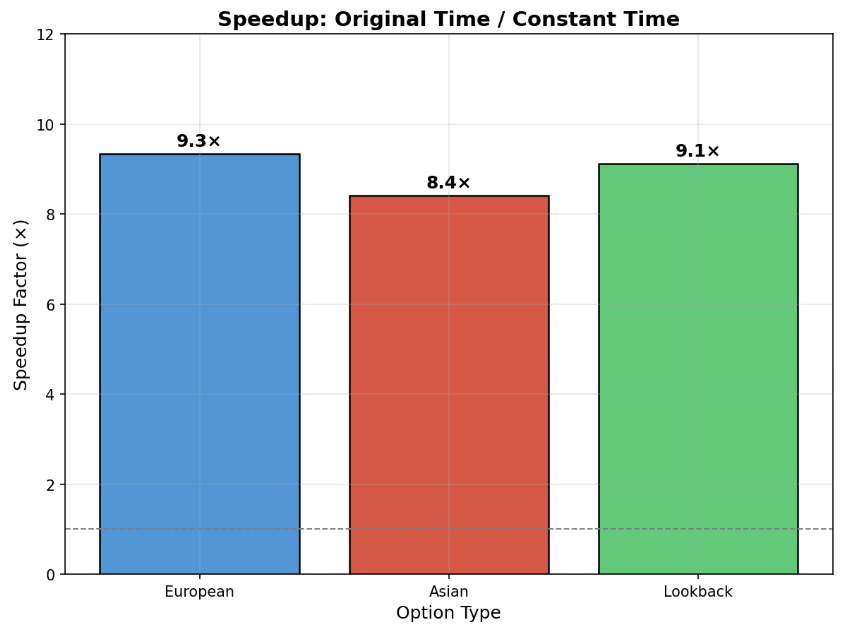
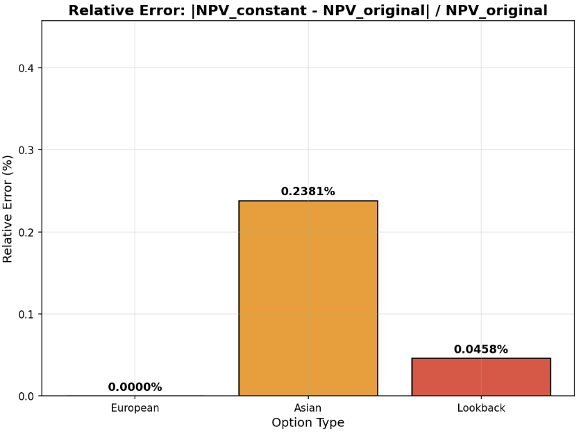

# QuantLib Monte Carlo Pricing Optimisation

**C++ · QuantLib · Black–Scholes · Monte Carlo · European, Asian and lookback options**

Academic team project at **IMT Atlantique**, supervised by **Luigi Ballabio**, March 2026. We extended supplied QuantLib Monte Carlo engines to support a constant-parameter Black–Scholes process, then examined the trade-off between runtime and pricing accuracy.

**Team:** Alexandre d’Hérissart, Raphael Lebel, Paul Trassaert and Thomas Lesage. This is Paul's portfolio fork of the [team repository](https://github.com/Dherale/ProjQuantlib), retaining the shared commit history and the [original course starter](https://github.com/lballabio/IMT2026). Implementation and analysis are presented as collective work.

[Full original presentation / report (17 pages)](Presentation_QuantlibProject.pdf) · [Original assignment and build notes](docs/original-assignment.md)

## Motivation

During path simulation, a generalised Black–Scholes process repeatedly queries rate and volatility term structures. These lookups are flexible but can be costly when repeated across a million Monte Carlo paths. The project extracts parameters once at the option maturity and uses scalar values throughout the simulation.

The reported benchmark shows roughly **7.91×–8.93× speedups** relative to the original engines, with small changes in the reported path-dependent prices. These figures describe the team's particular experiment, not a general performance guarantee.



*Ratios recalculated from Table 1 of the original report. The experiment has not been rerun for this documentation update.*

## Mathematical model

The constant-parameter process follows geometric Brownian motion under the risk-neutral measure:

$$dS_t=(r-q)S_t\,dt+\sigma S_t\,dW_t.$$

Its exact time-step evolution is

$$S_{t+\Delta t}=S_t\exp\left((r-q-\tfrac12\sigma^2)\Delta t+\sigma\sqrt{\Delta t}\,Z\right),\qquad Z\sim\mathcal N(0,1).$$

With spot $x$, the conditional expectation and variance are

$$\mathbb E[S_{t+\Delta t}\mid S_t=x]=xe^{(r-q)\Delta t},$$

$$\operatorname{Var}[S_{t+\Delta t}\mid S_t=x]=x^2e^{2(r-q)\Delta t}\left(e^{\sigma^2\Delta t}-1\right).$$

The helper freezes the risk-free and dividend rates at their continuously compounded maturity zero rates. The current code extracts volatility with `blackVol(maturity, strike)`. This is the final code correction; the report's description using spot instead of strike predates it. Discounting remains tied to the original risk-free term structure.

## Implementation

| Component | Role |
|---|---|
| [`constantblackscholesprocess.hpp`](constantblackscholesprocess.hpp), [`.cpp`](constantblackscholesprocess.cpp) | A `StochasticProcess1D` implementation with scalar spot, rates and volatility; exact GBM evolution and conditional moments. |
| [`constantprocesshelper.hpp`](constantprocesshelper.hpp) | Shared extraction of constant parameters, avoiding duplicated logic across engines. |
| [`mceuropeanengine.hpp`](mceuropeanengine.hpp) | `MCEuropeanEngine_2`: terminal European payoff. |
| [`mc_discr_arith_av_strike.hpp`](mc_discr_arith_av_strike.hpp) | `MCDiscreteArithmeticASEngine_2`: discrete arithmetic **average-strike** Asian payoff. |
| [`mclookbackengine.hpp`](mclookbackengine.hpp) | `MCFixedLookbackEngine_2`: fixed-strike lookback payoff. |
| [`main.cpp`](main.cpp) | Supplied benchmark comparing original, modified non-constant and modified constant engines. |

The modified builders expose `.withConstantParameters()` to select the fast process. The non-constant branch retains the general process so that its prices can be compared with the original QuantLib engines. The work extends provided engine code; it is not a reimplementation of QuantLib from scratch.

## Benchmark setup and reported results

The report uses one million Monte Carlo samples per engine, seed 42, spot 36, strike 40 and put payoffs. Evaluation date: 24 February 2022; maturity: 24 May 2022. The benchmark includes a non-flat risk-free curve (1% to 1.5%) and a volatility curve (20% at three months, 25% at six months), with zero dividend yield. European and lookback simulations use ten time steps; the Asian option uses nine fixing dates.

| Option | Original price | Modified, non-constant | Constant price | Original time (s) | Non-constant time (s) | Constant time (s) | Speedup¹ | Absolute relative price difference² |
|---|---:|---:|---:|---:|---:|---:|---:|---:|
| European | 4.17073 | 4.17073 | 4.17073 | 1.32851 | 1.31197 | 0.16802 | 7.91× | 0.000% |
| Asian, average-strike | 0.72943 | 0.72943 | 0.73117 | 1.18694 | 1.20794 | 0.14339 | 8.28× | 0.239% |
| Fixed lookback | 5.99980 | 5.99980 | 5.99705 | 1.30011 | 1.32523 | 0.14563 | 8.93× | 0.046% |

Source: Table 1 of the original report. ¹ Original time divided by constant time. ² Absolute difference from the original price, divided by that price, calculated using the displayed rounded numbers.

### Interpretation

- **European:** the payoff depends on the terminal asset value. Maturity-equivalent constant parameters can preserve the terminal distribution under appropriate deterministic-parameter assumptions. Equal rounded prices in this example do not prove equality for arbitrary curves or volatility surfaces.
- **Asian:** the payoff depends on the path average. Matching terminal parameters does not preserve every intermediate distribution, so freezing the curves can change the price.
- **Lookback:** the payoff depends on a path extremum. It is also sensitive to intermediate dynamics and monitoring granularity.
- **Runtime:** removing repeated term-structure queries explains the intended optimisation. The observed factor depends on hardware, curves, discretisation and engine configuration.

The report provides neither Monte Carlo uncertainty intervals nor repeated timing measurements/hardware details. Small price differences cannot be interpreted as statistically significant without those checks. The displayed report results are historical and do not independently validate the final strike-volatility correction.

## Original report figures

All three original charts are preserved below. **Some chart labels differ from Table 1**: in particular, the original speedup chart shows 9.3× / 8.4× / 9.1×, whereas the table implies 7.91× / 8.28× / 8.93×. Use the table and the recalculated chart above for the numerical summary. The originals remain available for transparency.

### Reported execution times



### Original speedup chart



### Original relative price differences



The [full original report](Presentation_QuantlibProject.pdf) preserves the complete methodology, equations, implementation discussion, conclusions and proposed extensions.

## Build and run

Requirements: a compiler supporting C++17, GNU Make, an installed QuantLib development environment and Boost headers. `quantlib-config` must be on your `PATH`.

```bash
git clone https://github.com/paultrassaert/quantlib-monte-carlo-optimisation.git
cd quantlib-monte-carlo-optimisation
make build
make test
```

`make` builds and runs the benchmark. `make test` invokes `./main`; it is a benchmark execution target, not an assertion-based unit-test suite. If your compiler defaults to a standard older than C++17, use:

```bash
g++ -std=c++17 *.cpp $(quantlib-config --cflags) -g0 -O3 $(quantlib-config --libs) -o main
./main
```

On macOS with Homebrew, if Boost headers are not found:

```bash
CPLUS_INCLUDE_PATH=/opt/homebrew/opt/boost/include make
```

This documentation update did not rerun compilation or the benchmark. The original report and source code are the evidence for the reported experiment.

## Possible extensions

The report discusses piecewise-constant parameters, finer time grids, variance reduction and parallelisation. These are proposed directions, not claims of implemented features. A stronger evaluation would also report Monte Carlo standard errors, repeated timings and additional curve/payoff configurations.
